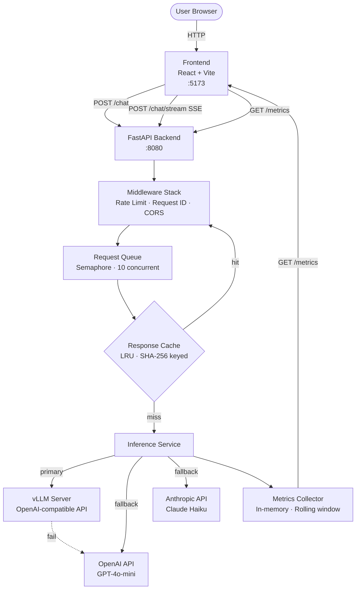

# LLM Serving System

A production-grade LLM inference platform with streaming, caching, rate limiting, and real-time observability. Supports **vLLM**, **OpenAI**, and **Anthropic** backends with seamless fallback.

---

## System Architecture



---

## Request Flow

```
User types message
       │
       ▼
  InputBar (React)
       │  POST /chat/stream
       ▼
  FastAPI /chat/stream
       │
  ┌────┴───────────────────────────────────┐
  │  RateLimitMiddleware (sliding window)  │
  │  RequestIDMiddleware (UUID + logging)  │
  └────┬───────────────────────────────────┘
       │
  ┌────▼──────────────┐
  │  Response Cache   │──── HIT ──▶ return cached + record 0ms latency
  └────┬──────────────┘
       │ MISS
  ┌────▼──────────────┐
  │  Request Queue    │  (asyncio.Semaphore, max 10 concurrent)
  └────┬──────────────┘
       │
  ┌────▼──────────────────────────────────────┐
  │  Inference Service                        │
  │  vLLM → OpenAI (fallback) → Anthropic     │
  │  Retry: 3 attempts, exponential backoff   │
  └────┬──────────────────────────────────────┘
       │  token stream
  ┌────▼──────────────┐
  │  SSE Generator    │  data: {"delta":"Hello","id":"..."}\n\n
  └────┬──────────────┘
       │
  StreamingText (React) — typing cursor animation
       │
  MetricsCollector.record(latency, tokens, success)
```

---

## Features

| Feature | Implementation |
|---|---|
| Streaming | Server-Sent Events (SSE) token-by-token |
| Caching | LRU cache, SHA-256 keyed, configurable TTL |
| Rate Limiting | Sliding-window per IP |
| Retry Logic | Tenacity, 3 attempts, exponential backoff |
| Fallback | vLLM → OpenAI → Anthropic |
| Concurrency | asyncio.Semaphore (10 concurrent) |
| Observability | Rolling p50/p95/p99 latency, tokens/sec, error rate |
| Logging | Structured JSON logs via structlog |
| Request Tracing | UUID per request, X-Request-ID header |

---

## Project Structure

```
model-serving/
├── backend/
│   ├── app/
│   │   ├── api/
│   │   │   ├── chat.py          # POST /chat, POST /chat/stream
│   │   │   ├── health.py        # GET /health
│   │   │   └── metrics.py       # GET /metrics, GET /metrics/detail
│   │   ├── core/
│   │   │   ├── config.py        # Pydantic settings from env
│   │   │   ├── logging.py       # structlog setup
│   │   │   └── middleware.py    # Rate limit + request ID
│   │   ├── models/
│   │   │   └── schemas.py       # Pydantic request/response schemas
│   │   ├── services/
│   │   │   ├── inference.py     # vLLM/OpenAI/Anthropic + retry + fallback
│   │   │   ├── cache.py         # LRU response cache
│   │   │   ├── queue.py         # Semaphore-based concurrency
│   │   │   └── metrics.py       # Rolling metrics collector
│   │   └── main.py              # FastAPI app, lifespan, middleware registration
│   ├── Dockerfile
│   └── requirements.txt
├── frontend/
│   ├── src/
│   │   ├── components/
│   │   │   ├── ChatWindow.tsx       # Message list + empty state
│   │   │   ├── MessageBubble.tsx    # User/assistant bubbles + latency badge
│   │   │   ├── InputBar.tsx         # Textarea + send/abort button
│   │   │   ├── MetricsDashboard.tsx # Live stats cards
│   │   │   └── StreamingText.tsx    # Animated cursor during streaming
│   │   ├── hooks/
│   │   │   ├── useChat.ts       # SSE streaming state machine
│   │   │   └── useMetrics.ts    # Polling metrics + health
│   │   ├── lib/
│   │   │   └── api.ts           # Typed fetch wrappers
│   │   ├── App.tsx              # Layout: sidebar + chat/metrics tabs
│   │   └── main.tsx
│   ├── Dockerfile
│   ├── nginx.conf
│   ├── package.json
│   └── vite.config.ts           # Dev proxy → backend :8080
├── docker/
│   └── docker-compose.yml
├── scripts/
│   ├── start_dev.sh
│   └── test_api.sh
├── .env.example
└── README.md
```

---

## Quick Start

### Prerequisites

- Python 3.11+
- Node.js 20+
- API key for OpenAI, Anthropic, or a running vLLM instance

### 1. Clone and configure

```bash
git clone <repo-url>
cd model-serving

cp .env.example .env
# Edit .env — set INFERENCE_BACKEND and the matching API key
```

### 2. Run with the dev script (recommended)

```bash
chmod +x scripts/start_dev.sh
./scripts/start_dev.sh
```

This installs dependencies, starts the backend on `:8080` and frontend on `:5173`.

### 3. Manual setup

**Backend:**
```bash
cd backend
python -m venv .venv
source .venv/bin/activate      # Windows: .venv\Scripts\activate
pip install -r requirements.txt

cp ../.env .                   # or set env vars

uvicorn app.main:app --host 0.0.0.0 --port 8080 --reload
```

**Frontend:**
```bash
cd frontend
npm install
npm run dev
```

**Open:** http://localhost:5173

---

## Docker Deployment

```bash
cp .env.example .env
# Edit .env with API keys

docker compose -f docker/docker-compose.yml up --build
```

- Frontend: http://localhost:3000
- Backend API: http://localhost:8080
- Swagger docs: http://localhost:8080/docs

---

## Configuration Reference

| Variable | Default | Description |
|---|---|---|
| `INFERENCE_BACKEND` | `openai` | `vllm` \| `openai` \| `anthropic` |
| `OPENAI_API_KEY` | — | OpenAI API key |
| `OPENAI_MODEL` | `gpt-4o-mini` | Model name |
| `ANTHROPIC_API_KEY` | — | Anthropic API key |
| `ANTHROPIC_MODEL` | `claude-haiku-4-5-20251001` | Model name |
| `VLLM_BASE_URL` | `http://localhost:8000/v1` | vLLM server URL |
| `VLLM_MODEL` | `meta-llama/Llama-3.1-8B-Instruct` | vLLM model |
| `CACHE_ENABLED` | `true` | Enable response caching |
| `CACHE_TTL_SECONDS` | `300` | Cache entry lifetime |
| `CACHE_MAX_SIZE` | `1000` | Max cached entries (LRU eviction) |
| `RATE_LIMIT_REQUESTS` | `60` | Max requests per window |
| `RATE_LIMIT_WINDOW` | `60` | Window size in seconds |
| `REQUEST_TIMEOUT_SECONDS` | `120` | Per-request timeout |
| `MAX_TOKENS_DEFAULT` | `1024` | Default generation limit |

---

## API Reference

### `POST /chat` — Non-streaming

```bash
curl -X POST http://localhost:8080/chat \
  -H "Content-Type: application/json" \
  -d '{
    "messages": [{"role": "user", "content": "What is vLLM?"}],
    "max_tokens": 256,
    "temperature": 0.7
  }'
```

Response:
```json
{
  "id": "chatcmpl-abc123",
  "model": "gpt-4o-mini",
  "content": "vLLM is a high-throughput LLM serving library...",
  "prompt_tokens": 14,
  "completion_tokens": 87,
  "total_tokens": 101,
  "latency_ms": 843.2,
  "cached": false
}
```

### `POST /chat/stream` — SSE Streaming

```bash
curl -N -X POST http://localhost:8080/chat/stream \
  -H "Content-Type: application/json" \
  -d '{"messages":[{"role":"user","content":"Count from 1 to 5."}]}'
```

Stream:
```
data: {"id":"req-001","delta":"1","finish_reason":null}
data: {"id":"req-001","delta":", 2","finish_reason":null}
data: {"id":"req-001","delta":"","finish_reason":"stop","latency_ms":1243.1}
data: [DONE]
```

### `GET /health`

```json
{"status":"ok","backend":"openai","model":"gpt-4o-mini","version":"1.0.0"}
```

### `GET /metrics`

```json
{
  "total_requests": 142,
  "cache_hits": 23,
  "avg_latency_ms": 731.4,
  "p50_latency_ms": 680.0,
  "p95_latency_ms": 1420.0,
  "p99_latency_ms": 2100.0,
  "tokens_per_second": 47.8,
  "requests_per_minute": 14.2,
  "error_rate_pct": 0.7
}
```

---

## Performance Notes

| Optimization | Impact |
|---|---|
| Response caching | 0ms latency for repeated queries |
| SSE streaming | First token appears ~200ms before full response |
| Concurrency semaphore | Prevents backend overload under burst traffic |
| Retry + fallback | Provider failures invisible to users |
| Sliding-window rate limit | Protects against abuse without blocking legit bursts |
| vLLM continuous batching | Up to 23× higher throughput vs naive inference |

---

## Test the API

```bash
chmod +x scripts/test_api.sh
./scripts/test_api.sh http://localhost:8080
```
